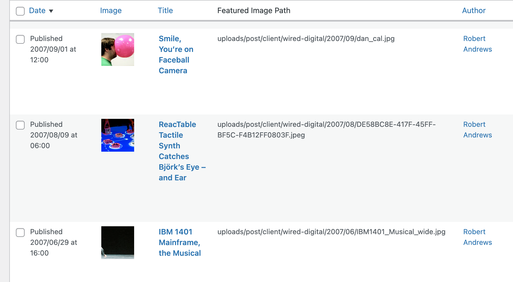

# Posts Column for Featured Image Path

This WordPress plugin adds a custom column to the Posts list in the WordPress admin area. The column displays the path of any attached Featured Image for each post.

## Installation

1. Upload the `column-featured-img-path` folder to the `/wp-content/plugins/` directory.
2. Activate the plugin through the 'Plugins' menu in WordPress.
3. Go to the 'Posts' screen in the WordPress admin area to see the new custom column.

## Usage

After activating the plugin, a new custom column named 'Featured Image Path' will appear in the Posts list in the WordPress admin area. The column displays the path of any attached Featured Image for each post. The path shown in the column is relative to the 'wp-content' directory.

## Changelog

### 1.0.0

* Initial release

## License

This plugin is licensed under the MIT License - see the [LICENSE](LICENSE) file for details.
